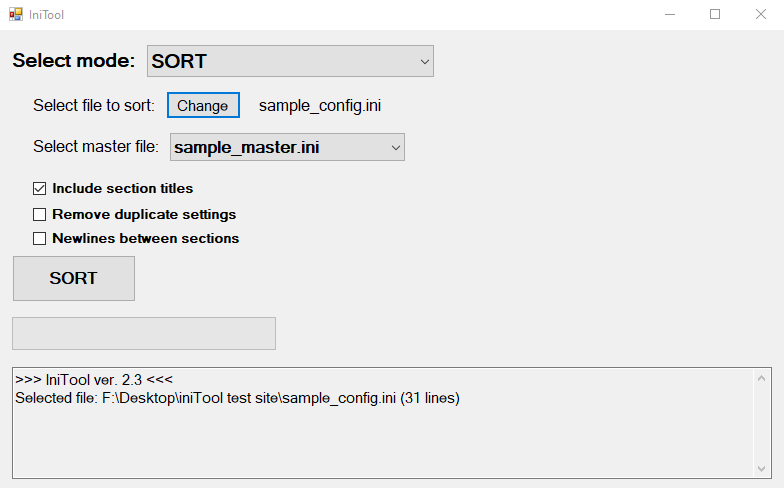

# IniTool
 Sorting tool for Bethesda's .ini and plugin files. WIP.

# Prerequisites:
- Place master files inside the "Resources" folder before running the program.

# Modes:
	SORT - sorts selected file according to a master file
